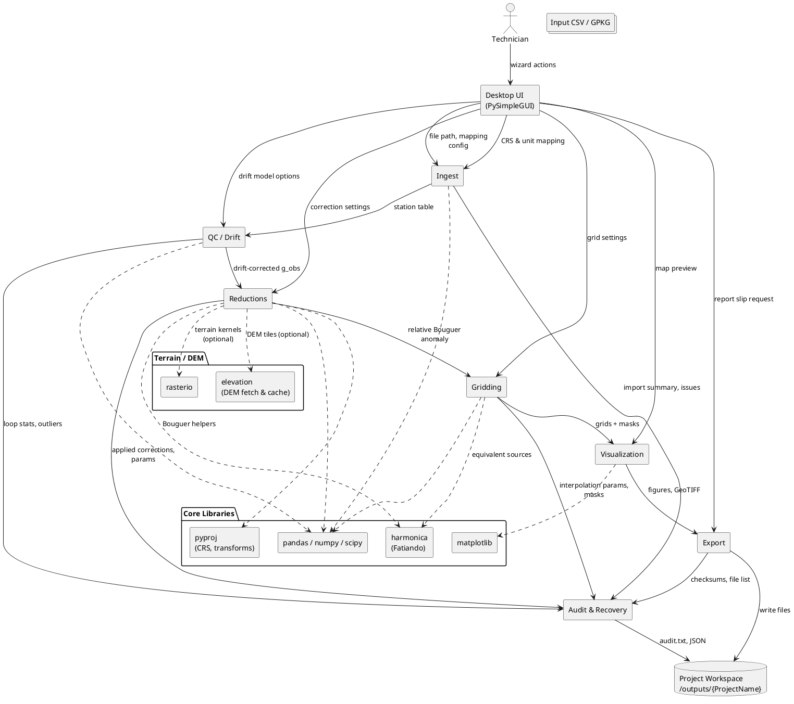
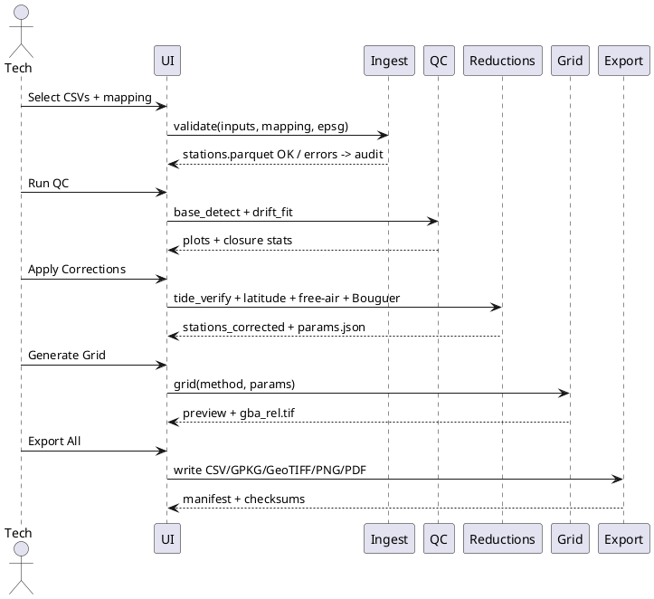

# SPEC-1-THG Gravity Desk App — Consolidated Spec (working draft)

## Background

THG Geophysics currently runs a spreadsheet‑driven microgravity reduction workflow for relative surveys (CG‑5 class). The goals are: (1) faithfully reproduce existing spreadsheet results to ±0.001 mGal; (2) automate QC (base loops, drift); (3) add gridding/mapping; and (4) provide a defensive pipeline that **auto‑verifies tide/latitude** to catch field configuration mistakes (time/coords).

## Requirements

**Must (M):**

* Desktop Python app (Windows 11 primary; Windows 10 best effort) with PySimpleGUI 5‑tab wizard.
* Import CG‑5 exports; column mapping; unit/CRS checks.
* Auto base detection, loop closures, robust drift (linear/piecewise) with plots.
* Apply/verify: Tide, Latitude; compute Free‑air, Bouguer slab; optional Bullard B/C.
* Normalization to site median or designated base; relative Bouguer anomaly.
* Gridding (Equivalent Sources default); optional IDW/linear; footprint mask.
* Exports: stations CSV + GeoPackage; GeoTIFF; PNG map; methods/citations; short PDF report.
* Logging/audit; recovery from malformed rows.
* Reproduce spreadsheets ±0.001 mGal; grid contour stats within ±2%.

**Should (S):** MSI installer (signed), colorblind‑safe defaults, verification plots/panels, manifest + checksums, deterministic re‑runs.

**Could (C):** USGS 1‑m/Copernicus DEM; parallel terrain; grid CV; labeled contour exports.

**Won’t (W) Phase 1:** Inversion (SimPEG/pyGIMLi); advanced terrain masking.

## Method — Architecture Overview & Module Responsibilities (for review)

### High-level Architecture



### Module Responsibilities & Key Interfaces

**UI (PySimpleGUI)**

* 5-tab wizard: *Import → QC/Drift → Corrections → Grid/Mask → Export*.
* Presents column-mapping, CRS selection, parameter forms with live validation.
* Emits a `ProjectConfig` JSON to drive the pipeline and stores recent profiles.

**ingest/**

* Parse CG‑5 (and equivalent) CSV exports with flexible dialect detection.
* GUI-assisted column mapping; unit sanity checks (mGal, meters); timezone normalization.
* Reprojects coordinates using `pyproj`; outputs canonical `stations.parquet`.
* Detect malformed rows; skip & append to `audit/import_errors.txt`.

**qc/**

* Base station auto-detection (frequency + temporal clustering).
* Build traverses; compute loop closures; fit drift (linear or piecewise) with robust regression.
* Flag duplicates/outliers; produce drift plots & closure stats table.
* Output: `stations_drift.parquet` with `g_corr_drift` and QC flags.

**reductions/**

* Apply/verify instrument Latitude & Tide corrections; recompute if missing (Longman 1959).
* Free‑air (+0.3086 mGal/m) and Bouguer slab (2πGρ; default ρ=2.67 g/cm³) with density override.
* Optional Curvature (Bullard B) and Terrain (Bullard C): near-field Hammer, far-field prism (Plouff 1977) using DEM tiles.
* Normalization to site median or chosen base; produce relative Bouguer anomaly `gba_rel` per station.
* Output: `stations_corrected.parquet` + method parameters JSON.

**grid/**

* Equivalent-sources interpolation (default) via `harmonica`; optional IDW & linear.
* Footprint masking; grid extent padding; cell size heuristics from station spacing.
* Outputs: `gba_rel.tif` (float32 GeoTIFF), `gba_rel.png`, contour shapefile/GeoPackage.

**viz/**

* Matplotlib figures: drift curves, loop closures, histogram of residuals.
* Map composer: colorblind-safe heatmap, contours, station points, vector overlays.
* Exposes `make_report_figures(project_dir)` used by Export.

**export/**

* Station CSV and GeoPackage; grid GeoTIFF & PNG; contour layers.
* Auto-generate `methods_and_citations.txt` and a 1–2 page PDF Report Slip (parameters, stats, thumbnails).
* Checksums (SHA-256) and manifest for reproducibility.

**audit/**

* Central logger producing human-readable TXT + structured JSON summaries.
* Records inputs, parameters, warnings, data QA events, and exception traces.
* Recovery helpers to resume from last successful artifact.

### Data Flow Contracts (IO)

* `stations.parquet` (post-ingest) → `stations_drift.parquet` (post-QC) → `stations_corrected.parquet` (post-reductions).
* Grid inputs consume `stations_corrected.parquet` and `ProjectConfig.json`.
* All stages append to `audit/audit.txt` and write a stage-specific JSON block under `audit/summary.json`.

### Defensive Behaviors

* Strict schema validation at each stage; refuse to proceed on critical mismatches.
* All optional corrections are idempotent and can be re-run without double-counting (tracked via flags in schema).
* Graceful degradation when DEM is unavailable: skip B/C corrections, warn, proceed with slab only.

## Data Schemas (for review)

### Station Table — `stations.parquet`

| Field              | Type                | Units / CRS         | Notes                                                       |
| ------------------ | ------------------- | ------------------- | ----------------------------------------------------------- |
| station_id         | string              | —                   | Required; unique within project.                            |
| line_id            | string?             | —                   | Optional traverse/line name.                                |
| source_file        | string              | —                   | Original CSV filename.                                      |
| source_row         | int                 | —                   | 1-based row index in source.                                |
| instrument         | string              | —                   | e.g., `CG-5`.                                               |
| instrument_sn      | string?             | —                   | Serial number if available.                                 |
| header_gmt_offset  | float?              | hours               | From CG‑5 header if present.                                |
| ts_device          | datetime            | device clock        | Timestamp recorded by CG‑5 (raw).                           |
| ts_mode            | string              | —                   | One of: `cg5_gmt`, `local_with_tz`.                         |
| project_tz         | string              | IANA                | e.g., `America/Chicago`. Used when `ts_mode=local_with_tz`. |
| ts_utc             | datetime (tz-aware) | UTC                 | Canonical timestamp after normalization.                    |
| lat                | float64             | degrees (EPSG:4326) | Positive north.                                             |
| lon                | float64             | degrees (EPSG:4326) | Positive east (west negative).                              |
| easting            | float64?            | meters              | Populated if a projected CRS is chosen.                     |
| northing           | float64?            | meters              | —                                                           |
| crs_working        | string              | EPSG code           | e.g., `EPSG:26915` (NAD83 / UTM 15N).                       |
| sensor_height_m    | float64             | m                   | From CG‑5 altitude entry; used for Free‑air.                |
| ground_elev_m      | float64?            | m                   | From DEM if available.                                      |
| station_elev_m     | float64?            | m                   | `ground_elev_m + sensor_height_m` (computed).               |
| g_obs_mgal         | float64             | mGal                | Observed gravity from instrument.                           |
| base_flag          | bool                | —                   | True if auto-identified as base.                            |
| loop_id            | string?             | —                   | Identifier for base loop grouping.                          |
| duplicate_flag     | bool                | —                   | Deduped by (station_id, ts_utc).                            |
| outlier_flag       | bool                | —                   | From robust stats during QC.                                |
| drift_corr_mgal    | float64             | mGal                | Modeled instrument drift applied.                           |
| g_corr_drift_mgal  | float64             | mGal                | `g_obs_mgal - drift_corr_mgal`.                             |
| lat_corr_mgal      | float64             | mGal                | From device (verified) or recomputed.                       |
| tide_corr_mgal     | float64             | mGal                | From device (verified) or recomputed.                       |
| free_air_corr_mgal | float64             | mGal                | `+0.3086 * sensor_height_m`.                                |
| bouguer_slab_mgal  | float64             | mGal                | `2πGρ * sensor_height_m` (ρ configurable).                  |
| bullard_b_mgal     | float64?            | mGal                | Curvature correction (optional).                            |
| bullard_c_mgal     | float64?            | mGal                | Terrain correction (optional).                              |
| density_g_cm3      | float32             | g/cm³               | Used for Bouguer slab (default 2.67).                       |
| gba_rel_mgal       | float64             | mGal                | Final relative Bouguer anomaly.                             |
| method_version     | string              | —                   | e.g., `2025.10.0`.                                          |
| applied_flags      | list[str]           | —                   | Provenance (e.g., `{"tide:instrument","bullardB:off"}`).    |
| qc_notes           | string?             | —                   | Free-form remarks.                                          |

**Storage:** Columnar Parquet (snappy) with a `station_id, ts_utc` sorted index.

**Constraints & Checks**

* Enforce unit sanity: `sensor_height_m ∈ [0, 3]`; `|lat| ≤ 90`, `|lon| ≤ 180`.
* Reject rows if `g_obs_mgal` outside empirical range `[-100000, 100000]` mGal (obvious corruptions).
* Soft-fail for missing DEM values; fill `ground_elev_m` as `NaN` and proceed.

### Drift/QC Artifacts

* `stations_drift.parquet`: same schema + populated `drift_corr_mgal`, `g_corr_drift_mgal`, `outlier_flag`, `loop_id`, `base_flag`.
* `qc/closure_stats.csv`: per-loop residuals, RMS, max closure.

### Corrections Artifacts

* `stations_corrected.parquet`: same schema + filled correction columns, `gba_rel_mgal`.
* `reductions/params.json`: exact constants & switches used (see Config schema below).

### Grid Artifacts

* `grid/gba_rel.tif`: float32 GeoTIFF in working CRS.
* `grid/gba_rel.png`: rendered preview.
* `grid/contours.gpkg`: contour lines & labeled intervals.

### Project Config — `ProjectConfig.json` (JSON Schema excerpt)

```json
{
  "$schema": "https://json-schema.org/draft/2020-12/schema",
  "title": "THG Gravity Desk Project Config",
  "type": "object",
  "required": ["project_name", "paths", "crs", "time", "ingest", "qc", "reductions", "grid", "viz", "export"],
  "properties": {
    "project_name": {"type": "string"},
    "paths": {
      "type": "object",
      "properties": {
        "workspace": {"type": "string"},
        "inputs": {"type": "string"},
        "outputs": {"type": "string"}
      },
      "required": ["workspace", "inputs", "outputs"]
    },
    "crs": {
      "type": "object",
      "properties": {
        "input_epsg": {"type": "integer"},
        "working_epsg": {"type": "integer"}
      },
      "required": ["working_epsg"]
    },
    "time": {
      "type": "object",
      "properties": {
        "ts_mode": {"enum": ["cg5_gmt", "local_with_tz"]},
        "project_tz": {"type": "string"}
      },
      "required": ["ts_mode"]
    },
    "ingest": {
      "type": "object",
      "properties": {
        "column_mapping": {"type": "object"},
        "units": {
          "type": "object",
          "properties": {
            "height_unit": {"enum": ["m", "ft"]},
            "g_unit": {"enum": ["mGal"]}
          }
        }
      }
    },
    "qc": {
      "type": "object",
      "properties": {
        "base_detection": {"type": "object", "properties": {"min_repeats": {"type": "integer", "default": 3}}},
        "drift_model": {"enum": ["linear", "piecewise"], "default": "linear"}
      }
    },
    "reductions": {
      "type": "object",
      "properties": {
        "tide": {"enum": ["instrument", "recompute", "auto_verify"], "default": "auto_verify"},
        "latitude": {"enum": ["instrument", "recompute", "auto_verify"], "default": "auto_verify"},
        "free_air_constant_mgal_per_m": {"type": "number", "default": 0.3086},
        "density_g_cm3": {"type": "number", "default": 2.67},
        "bullard_b": {"type": "boolean", "default": false},
        "bullard_c": {"type": "boolean", "default": false},
        "dem": {
          "type": "object",
          "properties": {
            "provider": {"enum": ["SRTM1", "USGS_1m", "Copernicus_30m"]},
            "cache_dir": {"type": "string"}
          }
        },
        "normalization": {"enum": ["site_median", "designated_base"], "default": "site_median"},
        "verification_threshold_mgal": {"type": "number", "default": 0.01}
      }
    },
    "grid": {
      "type": "object",
      "properties": {
        "method": {"enum": ["equivalent_sources", "idw", "linear"], "default": "equivalent_sources"},
        "equiv_sources": {"type": "object", "properties": {"depth": {"type": "number", "default": 5.0}, "damping": {"type": "number", "default": 1.0}}},
        "idw": {"type": "object", "properties": {"power": {"type": "number", "default": 2.0}}},
        "cell_size_m": {"type": "number"},
        "padding_m": {"type": "number", "default": 0},
        "mask_to_footprint": {"type": "boolean", "default": true}
      }
    },
    "viz": {
      "type": "object",
      "properties": {
        "colormap": {"type": "string", "default": "cividis"},
        "contour_interval_mgal": {"type": "number"}
      }
    },
    "export": {
      "type": "object",
      "properties": {
        "csv": {"type": "boolean", "default": true},
        "geopackage": {"type": "boolean", "default": true},
        "geotiff": {"type": "boolean", "default": true},
        "png_map": {"type": "boolean", "default": true},
        "report_pdf": {"type": "boolean", "default": true}
      }
    }
  }
}
```

### Example `ProjectConfig.json`

```json
{
  "project_name": "THG_Site_0425",
  "paths": {"workspace": "C:/THG_Gravity/Projects/THG_Site_0425", "inputs": "inputs", "outputs": "outputs"},
  "crs": {"input_epsg": 4326, "working_epsg": 26915},
  "time": {"ts_mode": "cg5_gmt", "project_tz": "America/Chicago"},
  "ingest": {"column_mapping": {"Station ID": "station_id", "DateTime": "ts_device", "Latitude": "lat", "Longitude": "lon", "Height": "sensor_height_m", "g_obs": "g_obs_mgal", "Notes": "notes"}, "units": {"height_unit": "m", "g_unit": "mGal"}},
  "qc": {"base_detection": {"min_repeats": 3}, "drift_model": "linear"},
  "reductions": {"tide": "auto_verify", "latitude": "auto_verify", "free_air_constant_mgal_per_m": 0.3086, "density_g_cm3": 2.67, "bullard_b": false, "bullard_c": false, "normalization": "site_median", "verification_threshold_mgal": 0.01},
  "grid": {"method": "equivalent_sources", "equiv_sources": {"depth": 5.0, "damping": 1.0}, "cell_size_m": 2.0, "padding_m": 0, "mask_to_footprint": true},
  "viz": {"colormap": "cividis", "contour_interval_mgal": 0.5},
  "export": {"csv": true, "geopackage": true, "geotiff": true, "png_map": true, "report_pdf": true}
}
```

## Defensive Corrections Strategy (Onboard vs Post-Processing)

**What CG‑5 does onboard (from vendor docs):**

* Provides **automatic real‑time tidal correction** when location & time are configured; also records a *tidal correction* value for display/transfer. It performs **instrument tilt compensation** and other automated filtering; and advertises “Automated corrections: *Tide, instrument tilt, temperature, noise filters*”.
* Does **not** advertise onboard *latitude* or *free‑air/Bouguer* geological corrections; these remain post‑processing steps.

**Policy:** default `auto_verify` mode for Tide & Latitude.

1. **Tide (Earth tide)**

   * Ingest reads any instrument-provided tide channel/flag (if present in CG‑5 dump) and computes a **reference tide** via Longman (1959) using `ts_utc` and station coordinates.
   * If `|tide_instrument - tide_ref| > verification_threshold_mgal` (default **0.01 mGal**), mark station with `applied_flags += {"tide:mismatch"}` and **replace** with `tide_ref` (unless user locks to instrument via UI).
   * Common failure modes caught: wrong GMT offset, wrong time, wrong site coords.

2. **Latitude correction**

   * Recompute using standard latitude formula (e.g., WGS‑84 normal gravity) from **station coordinates**; do **not** trust any embedded latitude adjustments unless explicitly supplied as a separate channel.
   * If instrument reports a latitude term, compare; if outside threshold, prefer recomputed value.

3. **Audit trail**

   * Write a per‑project `reductions/verification.csv` with columns: `station_id, tide_instr, tide_ref, diff_mgal, lat_instr?, lat_ref, action`.
   * Include histogram and time‑series plots of tide differences to quickly spot systemic offsets.

4. **UI guardrails**

   * Corrections tab shows a **“Tide source: Auto (verify)”** switch with a banner warning if mismatches exceed N stations or systemic bias detected.
   * Latitude correction has **no instrument mode** unless a channel is present; defaults to **Recompute** and is read‑only otherwise.

5. **Reproducibility**

   * The exact tide model, constants, and ephemerides versions are recorded in `reductions/params.json` and surfaced on the PDF Report Slip.

### Algorithms (concise)

```text
Tide_Ref(ts_utc, lat, lon) = Longman1959(ts_utc, lat, lon)  [mGal]
LatitudeCorr(lat) = g0(lat) - g0(lat0)
  where g0(lat) per Heiskanen & Moritz (1967) / WGS‑84 normal gravity.
FreeAir(h) = +0.3086 * h  [mGal per m]
BouguerSlab(h, rho) = 2πG*rho* h  [mGal]; rho default 2.67 g/cm^3
```

### Unit Tests (CI targets)

* **Tide cross‑check:** synthetic stations with known Longman values at canonical epochs; ensure `|tide_diff| < 0.001 mGal`.
* **Latitude sanity:** verify pole/equator limits vs reference implementation.
* **Instrument mismatch scenarios:** feed fixtures with wrong GMT offset/site to confirm auto‑replace logic and warnings.

### Packaging

* Ship **MSI installer** (signed) as default; include onefile exe for debugging.
* MSI registers file associations for `.thgproj` configs and adds Start‑menu shortcuts.

## UI Flow Mock‑up (PySimpleGUI) — for review

### Wizard Structure (5 tabs)

1. **Import**

   * Inputs: File picker (multi), profile dropdown, column mapping table, unit selectors, CRS selector.
   * Actions: *Validate*, *Save Profile*, *Next*.
   * Live checks: CSV dialect detection, header coverage, unit sanity, coordinate preview map (static PNG thumbnail from `viz`).

2. **QC / Drift**

   * Inputs: base detection min repeats, drift model (linear/piecewise), robust outlier toggle, duplicate resolver.
   * Views: loop table (RMS, max closure), drift plot, outlier list with include/exclude toggles.
   * Actions: *Run QC*, *Accept*, *Back/Next*.

3. **Corrections**

   * Inputs: Tide source (`Auto‑verify` / `Instrument` / `Recompute`), Latitude (`Recompute`), free‑air constant, density ρ, Bullard B/C toggles, DEM provider + cache dir, normalization (site median / designated base).
   * Views: tide verification histogram, tide diff time‑series, constants summary panel.
   * Actions: *Apply Corrections*, *Back/Next*.

4. **Grid / Mask**

   * Inputs: method (Equivalent Sources / IDW / Linear), ES depth & damping, IDW power, cell size, padding, mask to footprint.
   * Views: grid extent preview, station spacing stats, grid preview thumbnail.
   * Actions: *Generate Grid*, *Back/Next*.

5. **Export**

   * Inputs: select outputs (CSV, GPKG, GeoTIFF, PNG, Report PDF), output folder.
   * Views: manifest preview (filenames + checksums), citation blurb.
   * Actions: *Export All*, *Open Folder*, *Finish*.

### Minimal Layout Skeleton (runnable scaffold)

```python
import PySimpleGUI as sg

sg.theme('SystemDefault')

import_tab = [
    [sg.Text('Input CSVs'), sg.Input(key='-FILES-'), sg.FilesBrowse(file_types=(('CSV', '*.csv'),))],
    [sg.Text('CRS (working EPSG)'), sg.Input('26915', size=(8,1), key='-EPSG-')],
    [sg.Frame('Column Mapping', [[sg.Table(values=[], headings=['Source', 'Target'], key='-MAP-', auto_size_columns=True, num_rows=6)]])],
    [sg.Button('Validate'), sg.Push(), sg.Button('Next')]
]

qc_tab = [
    [sg.Text('Base repeats'), sg.Spin([i for i in range(1,10)], initial_value=3, key='-BASEREP-'),
     sg.Text('Drift model'), sg.Combo(['linear','piecewise'], default_value='linear', key='-DRIFT-')],
    [sg.Button('Run QC')],
    [sg.Image(key='-DRIFTPLOT-')],
    [sg.Table(values=[], headings=['Loop','RMS','Max'], key='-LOOPS-')],
    [sg.Button('Back'), sg.Push(), sg.Button('Next')]
]

corr_tab = [
    [sg.Text('Tide'), sg.Combo(['auto_verify','instrument','recompute'], default_value='auto_verify', key='-TIDE-'),
     sg.Text('Latitude'), sg.Text('recompute (fixed)')],
    [sg.Text('Free-air (mGal/m)'), sg.Input('0.3086', size=(8,1), key='-FA-'),
     sg.Text('Density ρ (g/cm³)'), sg.Input('2.67', size=(6,1), key='-RHO-')],
    [sg.Checkbox('Bullard B', key='-BULLB-'), sg.Checkbox('Bullard C (DEM)', key='-BULLC-')],
    [sg.Button('Apply Corrections')],
    [sg.Image(key='-TIDEHIST-')],
    [sg.Button('Back'), sg.Push(), sg.Button('Next')]
]

grid_tab = [
    [sg.Text('Method'), sg.Combo(['equivalent_sources','idw','linear'], default_value='equivalent_sources', key='-GRIDM-'),
     sg.Text('Cell size (m)'), sg.Input('2.0', size=(6,1), key='-CELLSZ-')],
    [sg.Text('ES depth'), sg.Input('5.0', size=(6,1), key='-ESDEP-'), sg.Text('Damping'), sg.Input('1.0', size=(6,1), key='-ESDAMP-')],
    [sg.Button('Generate Grid')],
    [sg.Image(key='-GRIDPREV-')],
    [sg.Button('Back'), sg.Push(), sg.Button('Next')]
]

export_tab = [
    [sg.Checkbox('CSV', True, key='-CSV-'), sg.Checkbox('GeoPackage', True, key='-GPKG-'),
     sg.Checkbox('GeoTIFF', True, key='-TIF-'), sg.Checkbox('PNG Map', True, key='-PNG-'), sg.Checkbox('Report PDF', True, key='-PDF-')],
    [sg.Text('Output Folder'), sg.Input(key='-OUTDIR-'), sg.FolderBrowse()],
    [sg.Button('Export All'), sg.Button('Open Folder'), sg.Push(), sg.Button('Finish')]
]

layout = [[sg.TabGroup([[sg.Tab('Import', import_tab), sg.Tab('QC/Drift', qc_tab), sg.Tab('Corrections', corr_tab), sg.Tab('Grid/Mask', grid_tab), sg.Tab('Export', export_tab)]])]]

window = sg.Window('THG Gravity Desk (Preview)', layout, finalize=True)

while True:
    event, values = window.read()
    if event in (sg.WINDOW_CLOSED, 'Finish'):
        break
    # TODO: wire to pipeline functions and update images/tables

window.close()
```

### Event Flow (happy path)



### Validation & Guardrails

* Buttons disabled until prior stage artifacts exist; red banner if audit has critical errors.
* Tide verification banner appears if >N stations exceed threshold or mean bias detected.
* “Re-run stage” re-computes deterministically using saved config.
* All figures saved to project folder; images shown in UI are thumbnails read from those artifacts.

## Phase 1 PR Plan — Ingest → QC/Drift → Corrections (defensive tides/latitude)

### Scope

* Parse CG‑5 text exports and CSVs; normalize to `stations.parquet` with strict schema.
* Implement base detection, loop closures, robust drift modeling.
* Implement *Auto‑Verify* for **tide** (compute Longman 1959) and **latitude** (WGS‑84 normal gravity); replace/flag if mismatched.
* Match THG spreadsheet results within ±0.001 mGal at station level.

### Inputs observed in THG samples (CG‑5)

* Headers: `Instrument S/N`, `Date`, `Time`, `LAT`, `LONG`, `ZONE`, `GMT DIFF`, *options* (`Tide Correction`, `Cont. Tilt`, `Auto Rejection`, `Terrain Corr.`, `Seismic Filter`).
* Data columns (rows): `LINE`, `STATION`, `ALT`, `GRAV`, `SD`, `TILTX`, `TILTY`, `TEMP`, `TIDE`, `DUR`, `REJ`, `TIME`, `DEC.TIME+DATE`, `TERRAIN`, `DATE`.
* We will map: `ALT → sensor_height_m`, `GRAV → g_obs_mgal`, `TIDE (if present) → tide_corr_mgal_instr`, `TIME/DATE → ts_device`, plus derived `ts_utc` from `GMT DIFF`.

### Parser tasks

1. **Dialect & header reader**: tolerate repeated header blocks and multiple *SURVEY* sections; capture `GMT DIFF` and options.
2. **Row reader**: robust float parsing; skip malformed; log to `audit/import_errors.txt` with 1‑based source row.
3. **Column mapping UI**: preload targets using the pattern above; allow override.
4. **CRS handling**: read LAT/LONG if present; otherwise rely on CSV columns.

### QC / Drift

* **Base detection**: (a) station name heuristics and frequency, (b) temporal proximity to start/end of loops.
* **Drift modeling**: linear or piecewise robust regression (Huber loss) on base loops; write `drift_corr_mgal` and closure stats.

### Corrections — Auto‑Verify policy

* **Tide**: compute `tide_ref` (Longman 1959) from `ts_utc, lat, lon`; compare to `tide_instr` (if present). If `|Δ| > 0.01 mGal` (configurable), set `tide_corr_mgal = tide_ref`, flag station, and surface a banner in UI.
* **Latitude**: recompute from station latitude (WGS‑84 normal gravity). If an instrument latitude term exists, log & compare; always prefer recomputed unless user explicitly locks to instrument.
* **Free‑air**: `+0.3086 mGal/m * sensor_height_m`.
* **Bouguer slab**: `2πGρ * sensor_height_m` (ρ default 2.67 g/cm³). Curvature/Terrain deferred to Phase 2.
* **Normalization**: site median (default) or designated base.

### Verification against THG reporting

* THG reports indicate **CG‑5 auto‑applied tide and latitude** in field acquisition; our Auto‑Verify ensures defensible replacements when device time/site settings are wrong.

### Deliverables

* `ingest.cg5_txt.read(path) -> DataFrame` + column mapping GUI.
* `qc.loop_closure.run(df) -> df_qc, closure_stats.csv, drift_plot.png`.
* `reductions.apply(df_qc, config) -> df_corr, params.json, verification.csv, tide_diff_plot.png`.
* Unit tests with fixtures built from sample files; golden outputs for ±0.001 mGal matching.

### Risks & Mitigations

* **Time zone mistakes**: trust `GMT DIFF` when present; otherwise `ts_mode=cg5_gmt` per project config; Fall back to `project_tz` only if needed; audit all conversions.
* **Instrument option ambiguity**: record options block verbatim in `audit/summary.json` and `stations.parquet` (new fields: `tide_option_enabled`, `tilt_comp_enabled`, …).
* **Malformed rows**: skip & log; never crash; show count in Import tab banner.

### Work Breakdown (PRs)

1. **PR#1 Ingest/CG5**: parser + schema validators + mapping UI + audit. Tests: header extraction, GMT handling, row parsing, error logging.
2. **PR#2 QC/Drift**: base detection, loop/closure, drift fit, plots, artifacts. Tests: synthetic loops + real subset.
3. **PR#3 Corrections**: tide/latitude Auto‑Verify, free‑air, Bouguer, normalization, params & verification artifacts. Tests: numerical tolerances, mismatch scenarios.
4. **PR#4 Export (Phase‑1)**: corrected station CSV+GPKG, basic PNG plot, audit manifest.

### Done Criteria (Phase 1)

* Run end‑to‑end on sample export; station‑level results match spreadsheet within ±0.001 mGal; verification artifacts created; Windows 11 MSI builds and runs out‑of‑box.

## Phase 2 Outline — DEM Integration, Terrain Corrections, Equivalent Sources & Mapping

### Goals

* Add optional **Bullard B (curvature)** and **Bullard C (terrain)** corrections using DEMs.
* Add **Equivalent Sources** default gridding with sane heuristics; optional IDW/linear retained.
* Produce high‑quality GeoTIFF + PNG map with colorblind‑safe defaults and contour overlays.

### DEM & Terrain Pipeline

1. **DEM Provider & Cache**

   * Default: SRTM 1‑arcsec (~30 m) via `elevation` with local cache under `dem_cache/`.
   * Configurable: USGS 1‑m (where available) or Copernicus 30 m (future hook).
2. **Tile Fetch**

   * Tile-by-extent using project footprint (+padding).
   * Persist VRT mosaic `terrain/project_dem.vrt` and a reprojected clipped raster in working CRS `terrain/dem_working.tif`.
3. **Sampling**

   * For each station, sample `ground_elev_m` via `rasterio.sample` (bilinear); compute `station_elev_m = ground + sensor_height_m`.
4. **Bullard B (Curvature)**

   * Implement LaFehr closed‑form correction using station elevation & Earth radius constants; toggle in UI.
   * Store per‑station `bullard_b_mgal`.
5. **Bullard C (Terrain)**

   * **Near‑field**: Hammer zones (A–M) from local DEM neighborhood; integrate height differences against zone factors to produce `bullard_c_near_mgal`.
   * **Far‑field**: Prism summation (Plouff) on decimated DEM grid out to configurable radius (e.g., 20 km) → `bullard_c_far_mgal`.
   * Sum to `bullard_c_mgal`.
6. **Defensive Behavior**

   * If DEM missing or too coarse (mean slope≈0 & σ≈0), skip terrain; warn in audit; continue with slab only.

### Equivalent Sources Gridding (Default)

* Use Harmonica **EquivalentSources** with point sources at depth `d = 0.5 × median station spacing` (min 2 m), damping tuned via GCV or a light grid‑search.
* Input data: `gba_rel_mgal` in working CRS coordinates (easting/northing).
* Grid cell size default: `cell = 0.25 × median spacing` (rounded to a nice number).
* Mask grid to **alpha shape** of stations (k‑nearest radius heuristic) with optional convex hull fallback.

### Map Composition

* Contours at configurable interval (default 0.5 mGal), labels on high‑contrast paths.
* Heatmap using colorblind‑safe default (e.g., `cividis`).
* Overlays: station points, base stations, survey boundary, scalebar, north arrow, legend.

### Artifacts

* `terrain/dem_working.tif`, `terrain/metrics.json` (resolution, slope stats).
* `reductions/bullard_b.csv`, `reductions/bullard_c.csv` for per‑station contributions.
* `grid/gba_rel.tif`, `grid/gba_rel.png`, `grid/contours.gpkg`.

### Heuristics & Defaults

* **DEM resolution guard**: if DEM pixel size > 3× median station spacing, show a warning banner: “Terrain corrections may be unreliable at this spacing.”
* **ES depth**: clamp to [2 m, 20 m] unless overridden.
* **Grid padding**: default 0, but suggest 1× cell if contours appear clipped.

### Unit Tests (Phase 2)

* Synthetic topography (Gaussian hill) → compare near‑field Hammer vs prism summation for convergence at small radii.
* Curvature test against LaFehr formula tables.
* ES cross‑validation: hold‑out 10% of stations; ensure RMSE ≤ IDW baseline.

### PR Breakdown

1. **PR#5 DEM Core**: provider wrapper, cache, VRT mosaic, clip/reproject, station sampling.
2. **PR#6 Bullard B**: LaFehr curvature module + tests.
3. **PR#7 Bullard C**: Hammer near‑field + Plouff far‑field prism; performance tuning; tests.
4. **PR#8 ES Gridding**: Harmonica ES wrapper with heuristics (depth/damping), mask generation, cross‑validation helper.
5. **PR#9 Map/Viz**: contours, layout, legend, scalebar; export to PNG + GeoTIFF with worldfile/CRS.

### UI Additions (Phase 2)

* Corrections tab: Bullard B/C toggles; DEM provider & cache path; far‑field radius; near‑field zone extent.
* Grid tab: ES depth/damping fields with “auto” option and small text showing the auto‑chosen values.

## Implementation (repo + CI + MSI)

### Repository Bootstrap (`github.com/Balooog/GravityDesk`)

```
GravityDesk/
├─ src/
│  └─ thg_gravity_desk/
│     ├─ __init__.py
│     ├─ app.py                 # GUI entry (PySimpleGUI)
│     ├─ cli.py                 # optional CLI for batch runs
│     ├─ ingest/
│     │  ├─ __init__.py
│     │  ├─ cg5_txt.py          # parser for CG‑5 TXT
│     │  ├─ mapping.py          # column mapping helpers
│     │  └─ schema.py           # pydantic models / checks
│     ├─ qc/
│     │  ├─ __init__.py
│     │  ├─ loops.py            # base detect, closure
│     │  └─ drift.py            # linear/piecewise robust fit
│     ├─ reductions/
│     │  ├─ __init__.py
│     │  ├─ tide.py             # Longman, verification
│     │  ├─ latitude.py         # normal gravity
│     │  ├─ freeair_bouguer.py
│     │  └─ normalize.py
│     ├─ grid/
│     │  ├─ __init__.py
│     │  ├─ equiv_sources.py
│     │  └─ simple_grids.py     # idw/linear
│     ├─ viz/
│     │  ├─ __init__.py
│     │  ├─ plots.py            # drift, tide diffs
│     │  └─ map.py              # contours, heatmap
│     ├─ export/
│     │  ├─ __init__.py
│     │  ├─ writers.py          # CSV, GPKG, GeoTIFF, PNG
│     │  └─ report.py           # PDF slip
│     └─ audit/
│        ├─ __init__.py
│        └─ audit.py            # logger & summary JSON
├─ tests/
│  ├─ data/ (sanitized fixtures)
│  ├─ test_ingest_cg5.py
│  ├─ test_qc_drift.py
│  ├─ test_reductions.py
│  └─ test_end_to_end.py
├─ pyproject.toml
├─ noxfile.py
├─ .ruff.toml
├─ .editorconfig
├─ .gitattributes
├─ LICENSE
├─ README.md
└─ .github/workflows/
   ├─ ci.yml
   └─ release-msi.yml
```

### Key Config Files (initial contents)

**pyproject.toml (excerpt)**

```toml
[build-system]
requires = ["setuptools>=69", "wheel"]
build-backend = "setuptools.build_meta"

[project]
name = "thg-gravity-desk"
version = "0.1.0"
description = "THG Gravity Desk — technician-friendly microgravity processing"
authors = [{name = "THG Geophysics"}]
requires-python = ">=3.11"
dependencies = [
  "pandas>=2.2",
  "numpy>=1.26",
  "scipy>=1.13",
  "pyproj>=3.6",
  "matplotlib>=3.8",
  "PySimpleGUI>=4.60",
  "geopandas>=0.14",
  "rasterio>=1.4",
  "elevation>=1.1",
  "harmonica>=0.7",
  "shapely>=2.0",
  "pydantic>=2.7",
  "reportlab>=4.1"
]

[project.scripts]
thg-gravity-desk = "thg_gravity_desk.app:main"

[tool.ruff]
line-length = 100
select = ["E","F","I","B","UP","N","C90"]
```

**noxfile.py (test matrix)**

```python
import nox

@nox.session(python=["3.11"])  # Align with PyInstaller target
def tests(session):
    session.install("-e", ".")
    session.install("pytest", "pytest-cov")
    session.run("pytest", "-q")
```

**.github/workflows/ci.yml (lint+test)**

```yaml
name: ci
on: [push, pull_request]
jobs:
  test:
    runs-on: windows-latest
    steps:
      - uses: actions/checkout@v4
      - uses: actions/setup-python@v5
        with: { python-version: '3.11' }
      - name: Install build deps
        run: |
          python -m pip install --upgrade pip
          pip install -e . nox ruff pytest
      - name: Lint
        run: ruff check .
      - name: Tests
        run: nox -s tests
```

**.github/workflows/release-msi.yml (PyInstaller + WiX)**

```yaml
name: release-msi
on:
  workflow_dispatch:
  push:
    tags:
      - 'v*'

jobs:
  build-msi:
    runs-on: windows-latest
    steps:
      - uses: actions/checkout@v4
      - uses: actions/setup-python@v5
        with: { python-version: '3.11' }
      - name: Install deps
        run: |
          python -m pip install --upgrade pip
          pip install -e . pyinstaller
      - name: Build onefolder exe
        run: |
          pyinstaller --noconfirm --name THGGravityDesk --onedir --windowed src/thg_gravity_desk/app.py
      - name: Install WiX
        run: choco install wixtoolset --no-progress -y
      - name: Package MSI (WiX Candle+Light)
        shell: pwsh
        run: |
          $ProductVersion = (python - <<<'import importlib.metadata as m;print(m.version("thg-gravity-desk"))')
          heat dir dist/THGGravityDesk --gg -srd -dr INSTALLDIR -cg AppFiles -var var.SourceDir -out Product.wxs
          candle Product.wxs -dSourceDir=dist/THGGravityDesk -ext WixUtilExtension
          light Product.wixobj -ext WixUIExtension -ext WixUtilExtension -out THGGravityDesk-$ProductVersion.msi -cultures:en-us
      - name: Upload artifact
        uses: actions/upload-artifact@v4
        with:
          name: msi
          path: THGGravityDesk-*.msi
```

**app.py (GUI entry stub)**

```python
import PySimpleGUI as sg

__version__ = "0.1.0"

def main():
    sg.theme('SystemDefault')
    layout = [[sg.Text(f'THG Gravity Desk v{__version__}')], [sg.Button('Quit')]]
    window = sg.Window('THG Gravity Desk', layout)
    while True:
        ev, _ = window.read()
        if ev in (sg.WINDOW_CLOSED, 'Quit'):
            break
    window.close()

if __name__ == '__main__':
    main()
```

### Notes for local dev with Codex

* Keep this spec in-repo under `docs/` as Markdown so your local tools can read it.
* Execute the app/tests on Windows Python 3.11 to match packaging.
